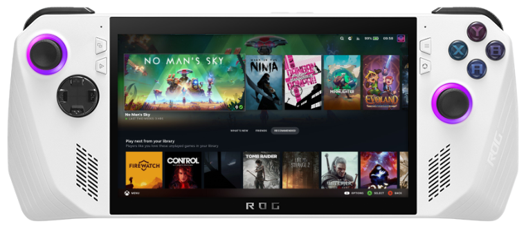

title: ASUS ROG Ally / Ally X

# ASUS ROG Ally / Ally X

{ .off-glb }

!!!info
    Some community members have been working with ASUS to solve the issue around Ally 1 and X having sometimes a faulty resume where the LED device of gamepad is missing. The fix has been found and is solved permanently in firmware. The Firmware is going through QA, and the estimated release date is October 16, 2024. To update your device you will require Windows (such as dual boot, or on a USB drive). There is an effort underway to reverse engineer the update protocol for use with fwupd.

## Features

| Feature | Notes |
| -- | -- |
| <no-wrap>:material-harddisk: Storage</no-wrap> | SteamFork can be run from an SD Card, USB Drive or installed directly to the internal NVME.   When installed directly to the NVME; an SD Card can be used for game storage. |
| <no-wrap>:material-wifi: Wifi</no-wrap> | Can be turned on in Steam OS under `Main Menu` > `Network`. |
| <no-wrap>:simple-bluetooth: Bluetooth</no-wrap> | Supports bluetooth audio and controllers .|
| <no-wrap>:material-fan: Fan</no-wrap> | Managed by system firmware. |
| <no-wrap>:material-lightning-bolt-circle: TDP Limit</no-wrap> | Can be set globally, per system or per game. Requires the [SimpleDeckyTDP](https://github.com/SteamFork/SimpleDeckyTDP) plugin.|
| <no-wrap>:material-vibrate: Rumble</no-wrap> | Enables the device rumble motor in emulators that support it. |

### Function Buttons

| Button | Function |
| -- | -- |
| ++"Command Center"++ | Press: <kbd>:material-microsoft-xbox: Guide</kbd> <no-wrap>(`Steam Menu`)</no-wrap> Hold: <no-wrap><kbd>:material-microsoft-xbox: Guide</kbd> + <kbd>:material-gamepad-circle-left: X</kbd></no-wrap> <no-wrap>(`On-Screen Keyboard`)</no-wrap> |
| ++"Armoury Crate"++ | Press: <no-wrap><kbd>:material-microsoft-xbox: Guide</kbd> + <kbd>:material-gamepad-circle-down: A</kbd><no-wrap> <no-wrap>(`Quick Access Menu`)</no-wrap> Hold: <kbd>:octicons-upload-16: Share</kbd> <no-wrap>(`Take Screenshot`)</no-wrap> |
| ++"M1"++ | ++"R4"++ |
| ++"M2"++ | ++"L4"++ |

## Notes

### Installation

Download the latest `AMD64` version of SteamFork from the button below and follow the instructions listed on the [Install](../../../play/install/) page.

### Booting from an external drive (USB or SD Card)

To boot SteamFork from an external drive, hold <kbd>:material-power: Power</kbd> until the device powers on.
Release <kbd>:material-power: Power</kbd> and repeatedly tap <kbd>:material-minus: Volume Down</kbd> until the `Bios Utility` appears.

Using the <kbd>:material-gamepad-round: D-pad</kbd> and <kbd>:material-gamepad-circle-down: A</kbd> or the touchscreen, select `Boot Menu` and select the storage device with SteamFork to boot the distribution.
