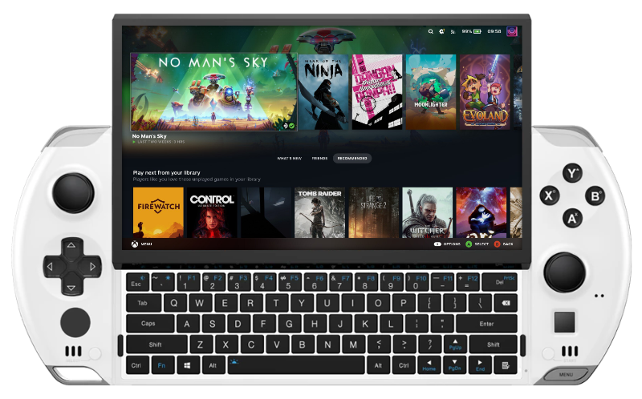

title: GPD Win 4

# GPD Win 4

{ .off-glb }

## Features

| Feature&nbsp;&nbsp;&nbsp;&nbsp;&nbsp;&nbsp;&nbsp;&nbsp;&nbsp;&nbsp;&nbsp;&nbsp;&nbsp;&nbsp;&nbsp;&nbsp; | Notes |
| -- | -- |
| :material-harddisk: Storage | SteamFork can be run from an SD Card, USB Drive or installed directly to the internal NVME.   When installed directly to the NVME; an SD Card can be used for game storage. |
| :material-wifi: Wifi | Can be turned on in Steam OS under Main Menu > Network. |
| :simple-bluetooth: Bluetooth | Supports bluetooth audio and controllers .|
| :material-fan: Fan | Requires the [FanControl](https://github.com/SteamFork/FanControl/releases) plugin.|
| :material-lightning-bolt-circle: TDP Limit | Can be set globally, per system or per game. Requires the [SimpleDeckyTDP](https://github.com/SteamFork/SimpleDeckyTDP) plugin.|
| :material-vibrate: Rumble | Enables the device rumble motor in emulators that support it. |

## Notes

### Installation

Download the latest `AMD64` version of SteamFork from the button below and follow the instructions listed on the [Install](../../../play/install/) page.

### Booting from an external drive (USB or SD Card)

In order to launch SteamFork from a USB drive or SD Card you will need to first change the boot order in the BIOS.

During boot you can enter the bios by either pressing the ++del++ key on the built-in keyboard.

In the bios; navigate to the `Boot` menu and then change the boot order to prioritize the SD card under `Boot Order Priorities`. Then go `Save & Exit` and select the Save Changes and Exit option.  This change will persist through all reboots.  If you want to boot into Windows simply remove the SD Card or USB drive.
